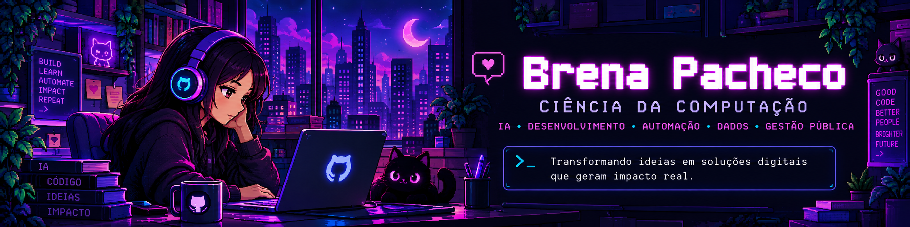
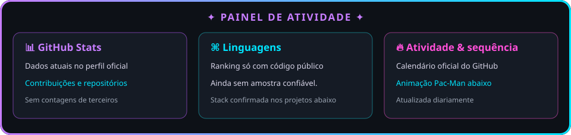

 

  

  

##  &nbsp; Sobre mim

> **Transformando ideias em soluções digitais que geram impacto real.**  
> Ciência da Computação · Inteligência Artificial · Desenvolvimento · Automação · Dados · Gestão Pública

<a href="https://github.com/BrenaPacheco">Abrir o perfil e o calendário oficial de contribuições</a>

## ⚙️ Tech stack & áreas de interesse

## 🚀 Projetos em destaque

<table>
<tr>
<td width="33%" valign="top">

### 🧠 Controladoria Responde
Assistente institucional que responde a servidores com base em documentos oficiais verificados. Faz parte do Projeto_IA.

🔒 Projeto_IA · repositório privado

</td>
<td width="33%" valign="top">

### 📊 Gestao_diarias
Sistema de controle da execução da LOA para viagens e diárias, com painel de indicadores, lançamentos e relatórios oficiais.

🔒 Repositório privado

</td>
<td width="33%" valign="top">

### 🤖 Projeto_IA
Aplicação institucional de IA com base documental, busca semântica e serviços de processamento de documentos.

🔒 Repositório privado

</td>
</tr>
</table>

<a href="https://github.com/BrenaPacheco?tab=repositories">⌕ Ver repositórios públicos</a>

## 👾 Pac-Man de contribuições

A animação é atualizada diariamente pelo GitHub Actions.

  

 

<b>“Que a tecnologia seja sempre um meio para transformar realidades.”</b>

<!-- O painel evita contagens estimadas e usa o calendário oficial do perfil. -->
